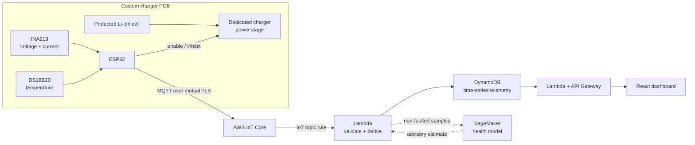
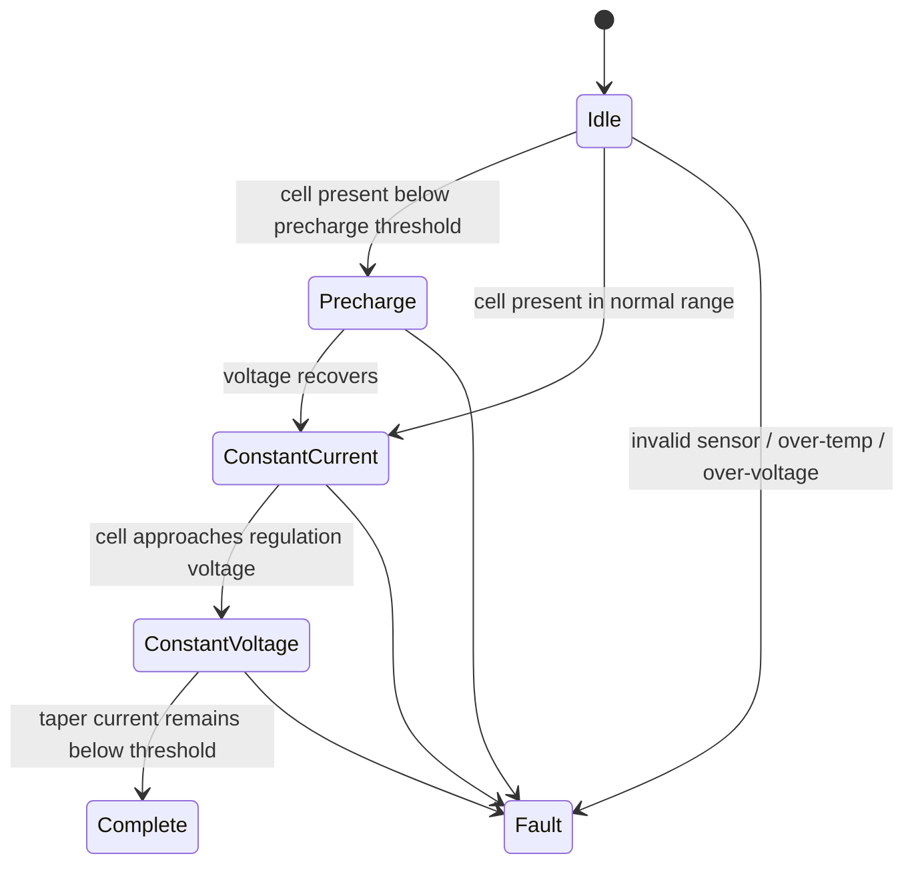

# Smart Battery Charger

[](https://github.com/JoshuaTian13/Smart-Battery-Charger/actions/workflows/ci.yml)

An ESP32-based lithium-battery charging and analytics platform spanning a custom sensor/charger PCB, deterministic embedded safety control, AWS IoT telemetry, DynamoDB time-series storage, SageMaker battery-health inference, and a React monitoring dashboard.


## System at a glance

| Layer | Engineering work |
| --- | --- |
| Hardware | Custom ESP32 PCB integrating an INA219 current/voltage monitor, DS18B20 temperature sensor, charger-stage control, and protected cell connections |
| Firmware | Arduino C++ acquisition, accumulated-capacity tracking, latched fault handling, CC/CV phase management, cycle counting, and MQTT telemetry |
| AWS | Mutual-TLS IoT Core ingestion, Lambda validation/processing, encrypted DynamoDB storage, S3 model artifacts, and an HTTP query API |
| Machine learning | Feature engineering, cycle-grouped train/holdout splitting, cross-validation, hyperparameter tuning, model comparison, and SageMaker deployment |
| Application | Responsive React dashboard for charge curves, device state, safety status, accumulated capacity, and advisory battery-health estimates |

## End-to-end architecture



## Engineering highlights

- Designed a local safety boundary in which the ESP32 can enable or inhibit an external regulated charger stage, while over-temperature, over-voltage, invalid-sensor, and completion decisions remain deterministic and fault-latched.
- Instrumented voltage, current, temperature, delivered capacity, charge phase, cycle count, and commanded current using the INA219, DS18B20, and ESP32 nonvolatile storage.
- Secured device-to-cloud telemetry with AWS IoT certificates and least-scope MQTT publishing, then validated and stored each device/timestamp record idempotently in DynamoDB.
- Built a battery-health workflow with cleaning, transformation, feature selection, grouped cross-validation, hyperparameter tuning, holdout evaluation, artifact serialization, and optional SageMaker inference.
- Developed a production-style React interface that can consume the AWS query API or clearly labeled synthetic demonstration data when no cloud stack is configured.

## Safety and control boundary



The model is intentionally advisory. Cloud availability and ML output never bypass local voltage, current, or temperature protection.

## Explore the project

| Area | Start here | What it shows |
| --- | --- | --- |
| PCB and sensing | [Hardware and control design](docs/hardware-and-control.md) | Signal path, interfaces, control phases, pin assignments, and PCB design boundaries |
| Embedded code | [ESP32 firmware](firmware/README.md) | Portable controller, INA219/DS18B20 acquisition, capacity integration, NVS cycles, and TLS MQTT |
| Cloud system | [AWS architecture](docs/aws-architecture.md) | IoT rule, Lambda processing, DynamoDB schema, API, model artifacts, and failure handling |
| Infrastructure | [SAM/CloudFormation stack](infrastructure/README.md) | Deployable AWS resources and least-scope IoT policy |
| ML pipeline | [Battery-health analytics](ml/README.md) | Synthetic reproducibility, grouped validation, model selection, and SageMaker deployment |
| Dashboard | [React interface](dashboard/README.md) | API configuration, demo mode, and the recruiter-facing telemetry UI |
| Verification | [Verification matrix](docs/verification.md) | Host tests, cloud boundary tests, ML smoke tests, dashboard build, and hardware validation plan |

## Data contract

Each telemetry record includes:

```json
{
  "schema_version": 1,
  "device_id": "charger-001",
  "timestamp_ms": 123456,
  "voltage_v": 4.02,
  "current_ma": 420.0,
  "temperature_c": 31.5,
  "battery_present": true,
  "phase": "constant_current",
  "fault": "none",
  "charge_enabled": true,
  "requested_current_ma": 800.0,
  "delivered_capacity_mah": 612.4,
  "cycle_count": 83
}
```

The cloud processor range-checks the fields, derives instantaneous power, optionally adds `predicted_health_pct`, and stores the result under the DynamoDB key `(device_id, timestamp_ms)`.

## Verify locally

The portable firmware and cloud/feature tests require only a C++17 compiler and Python:

```bash
make test
```

The full CI workflow additionally:

- generates an explicitly synthetic charge dataset;
- trains and evaluates the scikit-learn model pipeline; and
- installs and builds the React/Vite dashboard.

## Repository map

```text
firmware/       ESP32 application, portable CC/CV controller, and host test
cloud/          Lambda ingestion/query handlers, shared validation, and tests
infrastructure/ AWS SAM template and least-scope IoT device policy
ml/             Demo-data generator, features, training, inference, and SageMaker deployment
dashboard/      React/Vite telemetry and health-monitoring interface
docs/           Hardware, AWS, and verification case studies
examples/       Example telemetry and API response payloads
```

## Repository scope

The physical charger, custom PCB, ESP32/INA219/DS18B20 sensing, AWS telemetry, DynamoDB, React monitoring, and battery-analytics work come from the completed project. The original manufacturing package, credentials, AWS account resources, and full historical source were unavailable for publication, so this repository contains a coherent, tested portfolio implementation of that established architecture. See [NOTICE.md](NOTICE.md). This remains an engineering prototype, not a certified battery charger.
