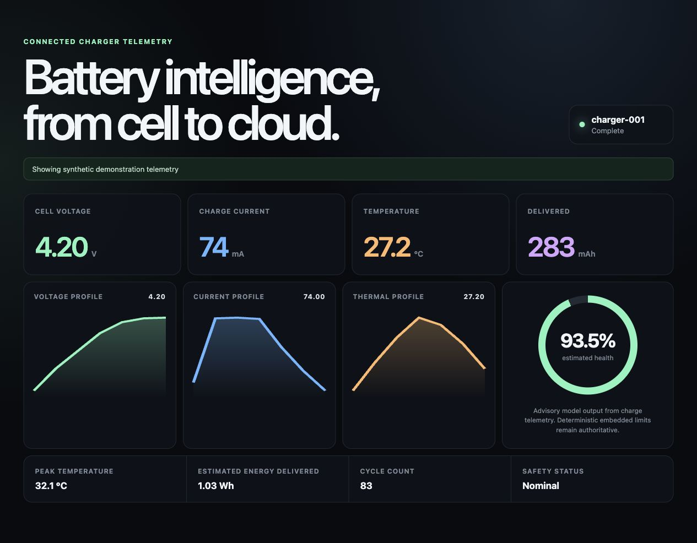

# React dashboard

The dashboard consumes the read-only Lambda/API Gateway endpoint and presents current charger state, voltage/current/temperature profiles, accumulated capacity, cycle count, safety status, and advisory model output.



## Run

```bash
npm install
VITE_API_BASE_URL=https://YOUR_API_ID.execute-api.REGION.amazonaws.com \
VITE_DEVICE_ID=charger-001 \
npm run dev
```

When `VITE_API_BASE_URL` is unset, the UI clearly labels and renders bundled synthetic demonstration data so the interface remains reviewable without an AWS account.
