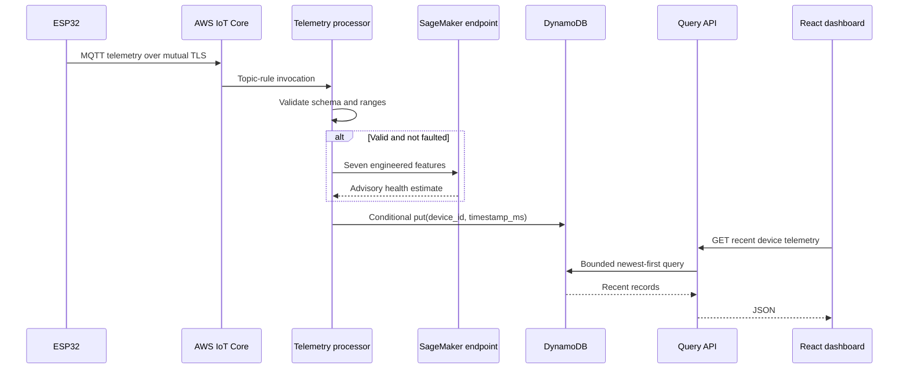

# AWS architecture

## Ingestion and storage

## MQTT contract

- Topic: `battery-charger/{device_id}/telemetry`
- Transport: MQTT/TLS on port 8883
- Identity: provisioned AWS IoT thing certificate
- Policy: connect as the thing name and publish only to its matching telemetry topic

The device cannot query the database, invoke SageMaker directly, or publish to another charger's topic.

## DynamoDB model

| Attribute | Type | Purpose |
| --- | --- | --- |
| `device_id` | String partition key | Isolates telemetry by charger |
| `timestamp_ms` | Number sort key | Orders measurements and provides an idempotency boundary |
| voltage/current/temperature | Number | Raw measured state |
| phase/fault/enable | String/Boolean | Embedded controller decisions |
| delivered capacity/cycle count | Number | Historical degradation features |
| `power_w` | Number | Derived cloud-side telemetry |
| `predicted_health_pct` | Number, optional | Advisory model output |

On-demand billing avoids provisioned-capacity tuning for a small fleet. Server-side encryption and point-in-time recovery are enabled.

## Failure behavior

| Failure | System response |
| --- | --- |
| Wi-Fi or MQTT outage | ESP32 disables the supervisory enable during reconnect; local sensor limits remain authoritative |
| Clock synchronization failure | ESP32 remains inhibited and restarts rather than opening TLS or publishing uptime-based record keys |
| Duplicate IoT delivery | Conditional DynamoDB put rejects the duplicate device/timestamp key |
| Malformed or out-of-range payload | Lambda returns a validation failure and does not write the record |
| SageMaker not configured | Telemetry is stored without a prediction |
| SageMaker failure | The inference boundary can fail independently; it must not change embedded charging safety |
| Dashboard/API outage | Charging and telemetry ingestion remain independent of the UI |

## Infrastructure as code

[`infrastructure/template.yaml`](../infrastructure/template.yaml) provisions the DynamoDB table, encrypted S3 model bucket, IoT rule, processing Lambda, HTTP API, and query Lambda. The optional endpoint parameter activates SageMaker invocation after a model is deployed.
