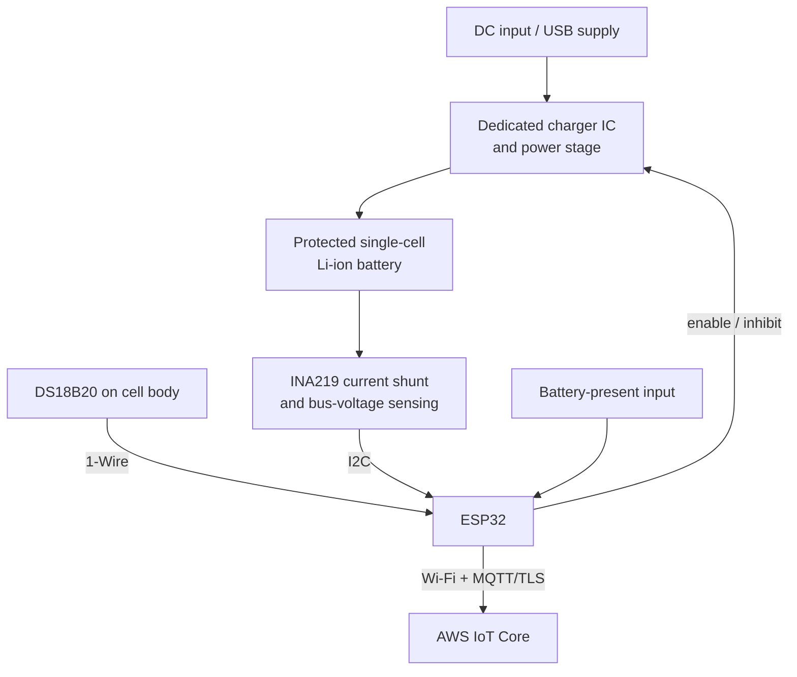

# Hardware and control design

## Functional block diagram

The custom PCB integrated the microcontroller, sensors, charger-stage interface, connectors, decoupling, pull-ups, and measurement routing. The portfolio intentionally documents the system boundary rather than inventing unavailable manufacturing files or an unverified charger-IC schematic.

## Interfaces

| Signal | ESP32 role | Design concern |
| --- | --- | --- |
| INA219 SDA/SCL | I2C telemetry | Shunt placement, bus-voltage range, pull-ups, address, and common reference |
| DS18B20 data | 1-Wire temperature | Cell contact, pull-up, conversion timing, and disconnected-sensor detection |
| Battery present | Digital input | Prevent charging logic from running against an open connector |
| Charger enable | Digital output | Fail-safe default low and independent hardware regulation |
| Wi-Fi / MQTT | Cloud telemetry | Mutual TLS, reconnect behavior, bounded payload, and no credentials in source |

## Deterministic controller

The controller uses four active phases:

1. **Precharge** requests a reduced current while cell voltage is below 3.0 V.
2. **Constant current** requests the normal current while voltage rises toward 4.2 V.
3. **Constant voltage** tapers the requested current near the regulation voltage.
4. **Complete** disables charging after measured current remains below 80 mA for three consecutive samples.

An invalid sensor value, temperature above 45 °C, or voltage more than 50 mV above the regulation target creates a latched fault. A transient measurement therefore cannot silently restart the charger.

## PCB review checklist

- Keep the current-sense path short and route Kelvin connections around the INA219 shunt.
- Separate high-current charger loops from ESP32, I2C, and 1-Wire signal paths.
- Place local decoupling at every IC and provide a low-impedance ground return.
- Keep the ESP32 antenna region clear of copper and noisy switching components.
- Default charger enable to the safe state during reset or unpowered MCU conditions.
- Provide accessible test points for input voltage, cell voltage, shunt voltage, ground, temperature data, and enable.
- Use appropriately rated connectors, copper width, protection, and thermal spacing for the selected charger current.

## Software is not the only protection

The ESP32 state machine is supervisory. The actual power stage must independently enforce the cell chemistry's current/voltage limits and include required protection against overcurrent, reverse connection, and unsafe cell conditions. The ML pipeline never controls that hardware boundary.
