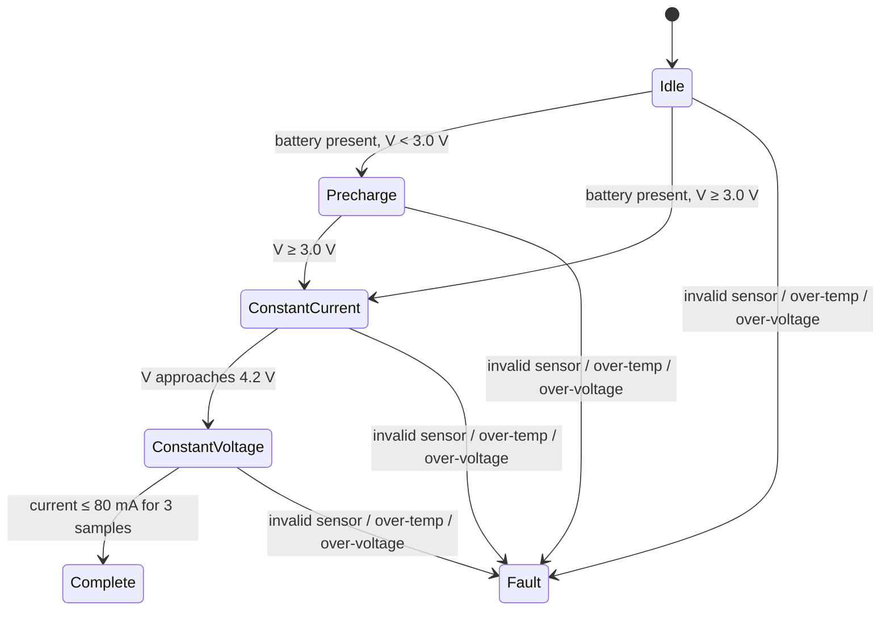

# ESP32 firmware

The firmware samples an INA219 current/voltage monitor and DS18B20 temperature sensor, evaluates a deterministic safety state machine, enables or inhibits an external charger stage, and publishes wall-clock-stamped telemetry to AWS IoT Core over mutual TLS. It synchronizes time with NTP before opening the TLS connection so certificate validation and DynamoDB record ordering do not depend on ESP32 uptime.

## Control phases



Faults are latched until an explicit controller reset. The ML path is not allowed to override these deterministic limits.

## Hardware boundary

The ESP32 requests a phase/current target and drives an enable signal. A dedicated charger/power-stage IC must independently regulate cell current and voltage and provide hardware protection. This separation keeps cloud availability or model output from becoming a safety dependency.

## Configuration

1. Copy `include/credentials.example.hpp` to `include/credentials.hpp`.
2. Add the provisioned AWS IoT endpoint, device certificate, private key, root CA, and Wi-Fi credentials.
3. Build with PlatformIO:

```bash
pio run
pio run --target upload
```

The portable controller test does not require Arduino or hardware:

```bash
make firmware-test
```
