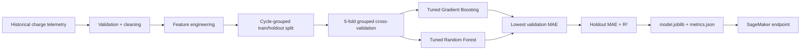

# Battery-health analytics

The ML layer estimates battery health as an advisory signal from voltage, current, temperature, instantaneous power, charge phase, accumulated delivered capacity, and cycle count.

## Training workflow



Grouping by charge cycle prevents samples from the same cycle from appearing in both training and validation folds. The selected model is evaluated once on a held-out set before serialization.

## Reproduce with synthetic demonstration data

The generator creates explicitly synthetic charge curves for testing the pipeline; it is not presented as measured hardware data.

```bash
python3 ml/generate_demo_data.py /tmp/battery-demo.csv
python3 ml/train.py /tmp/battery-demo.csv
```

## SageMaker deployment

```bash
pip install -r ml/requirements-deploy.txt
python3 ml/sagemaker_deploy.py \
  --role-arn arn:aws:iam::ACCOUNT_ID:role/SageMakerExecutionRole \
  --bucket MODEL_ARTIFACT_BUCKET
```

The deployment helper uses AWS's currently supported SageMaker Scikit-learn 1.4-2 inference image. The Lambda processor invokes the endpoint only when configured and only for non-faulted telemetry. Embedded current, voltage, and temperature safety limits remain deterministic and local.
